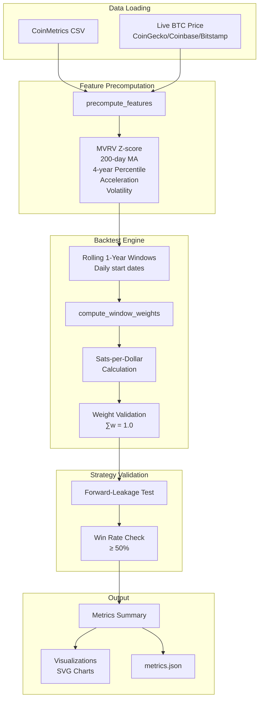

# Bitcoin DCA Backtest System

This document explains the backtesting framework in `backtest.py` and how to interpret its results for evaluating the dynamic DCA weight computation model.

## Overview

The backtest system validates the dynamic DCA strategy by comparing its performance against uniform DCA (equal daily allocations) across rolling 1-year investment windows from 2018-01-01 to the present.

**Key Metrics:**
- **Win Rate**: Percentage of windows where dynamic DCA outperforms uniform DCA
- **SPD Percentile**: Sats-per-dollar percentile within each window's min/max range
- **Model Score**: Combined metric (50% win rate + 50% exponential-decay percentile)

## Architecture



## Core Components

### Data Loading (`load_data`)

Loads Bitcoin price and MVRV data from CoinMetrics, extending it with today's live price:

```python
btc_df = load_data()
# Loaded CoinMetrics data: 6205 rows, 2009-01-03 to 2025-12-29
```

### Feature Precomputation

Computes all model features once, then reuses them across all windows:

```python
_FEATURES_DF = precompute_features(btc_df)
```

Features include:
- `price_vs_ma`: Distance from 200-day moving average
- `mvrv_zscore`: MVRV Z-score (365-day window)
- `mvrv_gradient`: Trend direction (30-day EMA)
- `mvrv_percentile`: 4-year rolling percentile
- `mvrv_acceleration`: Momentum indicator
- `mvrv_volatility`: Uncertainty measure
- `signal_confidence`: Signal agreement score

### Rolling Window Backtest

For each daily start date from 2018-01-01, creates a 1-year investment window:

```python
# Window: 2018-01-01 → 2019-01-01
# Window: 2018-01-02 → 2019-01-02
# ...
# Window: 2024-12-28 → 2025-12-28
```

**Total Windows**: 2554 (daily rolling windows)

### Sats-per-Dollar (SPD) Calculation

For each window, computes how many satoshis are obtained per dollar invested:

```python
inv_price = 1e8 / price  # sats per dollar
uniform_spd = inv_price.mean()  # equal daily amounts
dynamic_spd = (weights * inv_price).sum()  # weighted by model
```

The **SPD percentile** normalizes performance within each window:

```
percentile = (spd - min_spd) / (max_spd - min_spd) × 100
```

- **0%**: Worst possible timing (bought at highest prices)
- **50%**: Uniform DCA baseline
- **100%**: Perfect timing (bought at lowest prices)

## Interpreting Results

### Sample Backtest Output

```
2025-12-29 15:54:21 INFO     Backtesting date range: 2018-01-01 to 2025-12-28 (2554 total windows)
2025-12-29 15:54:25 INFO     ✓ Validated weight sums for 2554 windows (all sum to 1.0)
2025-12-29 15:54:25 INFO     Aggregated Metrics for Dynamic DCA:
2025-12-29 15:54:25 INFO       SPD: min=1084.79, max=22722.45, mean=7085.31, median=3300.38
2025-12-29 15:54:25 INFO       Percentile: min=4.40%, max=85.66%, mean=42.77%, median=45.26%
2025-12-29 15:54:25 INFO       Exp-decay avg SPD percentile: 56.21%
```

| Metric | Value | Interpretation |
|--------|-------|----------------|
| SPD min | 1,084.79 sats/$ | Worst window result |
| SPD max | 22,722.45 sats/$ | Best window result |
| SPD mean | 7,085.31 sats/$ | Average across all windows |
| SPD median | 3,300.38 sats/$ | Typical window result |
| Percentile min | 4.40% | Worst relative performance |
| Percentile max | 85.66% | Best relative performance |
| Percentile mean | 42.77% | Average percentile |
| Percentile median | 45.26% | Typical percentile |
| Exp-decay avg | 56.21% | Recent windows weighted more |

### Strategy Validation Output

```
Summary: 908/2554 underperformed (64.45% win rate)
✅ Strategy meets performance requirement (≥ 50% win rate vs. uniform DCA).
✅ Strategy is ready for submission.
```

| Metric | Value | Requirement |
|--------|-------|-------------|
| Windows tested | 2,554 | All rolling 1-year windows |
| Losses | 908 | Windows where dynamic < uniform |
| Win rate | 64.45% | ≥ 50% required |
| Status | ✅ Passed | Strategy ready for submission |

### Final Model Score

```
2025-12-29 15:54:38 INFO     Final Model Score: 60.33%
2025-12-29 15:54:38 INFO       Excess percentile: mean=4.07%, median=4.41%
2025-12-29 15:54:38 INFO       Relative improvement: mean=11.44%, median=10.76%
2025-12-29 15:54:38 INFO       Ratio (dynamic/uniform): mean=1.11, median=1.11
```

| Metric | Value | Formula |
|--------|-------|---------|
| Model Score | 60.33% | 0.5 × win_rate + 0.5 × exp_decay_percentile |
| Mean Excess | +4.07% | dynamic_percentile - uniform_percentile |
| Median Excess | +4.41% | Typical outperformance |
| Relative Improvement | 11.44% | excess / uniform × 100 |
| Ratio | 1.11 | dynamic / uniform |

## Underperformance Analysis

Windows where the strategy underperformed are displayed for analysis:

```
⚠️ Windows where strategy underperformed Uniform DCA:
                         dynamic_percentile  uniform_percentile     Delta
window                                                                   
2018-01-01 → 2019-01-01           32.350495           34.917062 -2.566567
2018-01-02 → 2019-01-02           32.776909           35.111968 -2.335059
...
2023-11-30 → 2024-11-30           42.035978           42.241877 -0.205899

[908 rows x 3 columns]
```

**Common patterns in underperforming windows:**
- Bear market entries (2018-2019): Model's value signals trigger too early
- Late-cycle windows (2023-2024): Model may reduce buying before final leg up

## Output Files

All outputs are saved to the `output/` directory:

| File | Description |
|------|-------------|
| `performance_comparison.svg` | Line chart: dynamic vs uniform percentile over time |
| `excess_percentile_distribution.svg` | Histogram of excess percentile distribution |
| `win_loss_comparison.svg` | Bar chart showing wins/losses breakdown |
| `cumulative_performance.svg` | Area chart of cumulative excess percentile |
| `metrics_summary.svg` | Table visualization of key metrics |
| `metrics.json` | Complete metrics data in JSON format |

## Validation Checks

### Weight Sum Validation

Every window's weights are validated to sum to exactly 1.0:

```python
assert np.isclose(weight_sum, 1.0, atol=1e-5)
# ✓ Validated weight sums for 2554 windows (all sum to 1.0)
```

### Forward-Leakage Test

Ensures weights only use past information:

```python
# For each probe date, mask future data and verify weights unchanged
for probe in sample_dates:
    masked_df = df.copy()
    masked_df.loc[masked_df.index > probe, :] = np.nan
    assert weights_match(masked_df, full_df, at=probe)
```

### Win Rate Requirement

Strategy must outperform uniform DCA in ≥50% of windows:

```python
win_rate = (dynamic_percentile > uniform_percentile).mean()
assert win_rate >= 0.5
```

## Usage

Run the backtest from the command line:

```bash
cd /path/to/bitcoin_modal
source venv/bin/activate
python backtest.py
```

The script will:
1. Load BTC data with today's live price
2. Precompute all model features
3. Run SPD backtest across all rolling windows
4. Validate weights and check for forward-leakage
5. Generate visualizations and export metrics

## Key Functions

### `compute_weights_modal(df_window)`

Wrapper that connects the backtest to the model's weight computation:

```python
def compute_weights_modal(df_window: pd.DataFrame) -> pd.Series:
    """Compute weights using compute_window_weights for validation."""
    start_date = df_window.index.min()
    end_date = df_window.index.max()
    current_date = end_date  # For backtesting, all dates are "past"
    return compute_window_weights(_FEATURES_DF, start_date, end_date, current_date)
```

### `backtest_dynamic_dca(dataframe, strategy_function)`

Main backtest driver that computes SPD statistics:

```python
df_spd, exp_decay_percentile = backtest_dynamic_dca(
    btc_df,
    compute_weights_modal,
    features_df=_FEATURES_DF,
    strategy_label="Dynamic DCA",
)
```

### `check_strategy_submission_ready(dataframe, strategy_function)`

Comprehensive validation for production readiness:
- Forward-leakage test (no future data used)
- Weight validation (non-negative, sum to 1.0)
- Performance check (≥50% win rate vs uniform DCA)

## Performance Characteristics

Based on the current backtest results:

| Metric | Current Value | Target |
|--------|---------------|--------|
| Win Rate | 64.45% | ≥ 50% |
| Model Score | 60.33% | Higher is better |
| Mean Excess | +4.07% | Positive |
| Median Excess | +4.41% | Positive |
| Exp-Decay Percentile | 56.21% | > 50% |

The strategy consistently outperforms uniform DCA with:
- **64.45% win rate** (1,646 wins / 908 losses)
- **11% relative improvement** on average
- **Stronger recent performance** (exp-decay average: 56.21%)