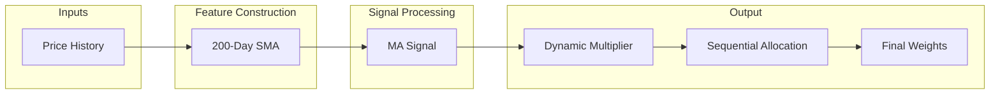

# Bitcoin DCA Weight Computation Model (Template Baseline)

This document explains the baseline ML model that computes dynamic DCA (Dollar Cost Averaging) weights for Bitcoin investment strategies based on price relative to the 200-day moving average.

## Overview

The template model computes daily investment weights that determine how much of your DCA budget to allocate on each day within a given investment window. Unlike uniform DCA (equal daily amounts), this baseline model dynamically adjusts weights based on:

1. **Price vs 200-day MA**: Buy more when price is below long-term trend

> [!NOTE]
> This is a **baseline template** that demonstrates the core weight computation framework. Example implementations like `example_1/` extend this with additional features (MVRV Z-score, Polymarket sentiment, etc.).

**Key Properties:**
- Weights sum to exactly 1.0 for each date range (within tolerance of 1e-6)
- All weights are ≥ MIN_W (1e-6) to prevent zero allocations
- Past weights are **locked** once computed and never change
- Future weights are **uniform** (remaining budget distributed evenly)
- Weights are deterministic given the same inputs

## Model Architecture

The weight computation uses a simple **200-day MA Signal Strategy**:




For a window of `n` days, the weight for day `i` is computed as:

```
weight[i] = allocate_sequential_stable(base[i] × dynamic[i])
```

Where:
- `base[i]` = 1/n (uniform base distribution)
- `dynamic[i]` = exp(ma_signal × DYNAMIC_STRENGTH)

## Signal Composition

The baseline model uses a single signal:

### Primary Signal

| Signal | Weight | Description |
|--------|--------|-------------|
| MA Signal | 100% | Below 200-day MA → buy more, above MA → buy less |

> [!TIP]
> Example implementations extend this baseline with additional signals. See `example_1/model_example_1.md` for an enhanced version with MVRV Z-score (64%), MA signal (16%), and Polymarket sentiment (20%).

## Feature Construction

### 200-Day Simple Moving Average

```python
price_ma200 = price.rolling(200, min_periods=100).mean()
price_vs_ma = (price / price_ma200) - 1  # Clipped to [-1, 1]
```

| Value | Interpretation |
|-------|----------------|
| `price_vs_ma > 0` | Price above 200-day MA (bullish) |
| `price_vs_ma < 0` | Price below 200-day MA (bearish) |
| `price_vs_ma = 0` | Price at 200-day MA |

### Look-Ahead Bias Prevention

All features are **lagged by 1 day** to prevent information leakage:

```python
features = features.shift(1).fillna(0)
```

This ensures the weight for day `t` only uses information available up to day `t-1`.


## Dynamic Multiplier Computation

The baseline model uses a simple signal transformation:

```python
def compute_dynamic_multiplier(price_vs_ma):
    # Signal: negative price_vs_ma = below MA = buy more
    signal = -price_vs_ma
    
    # Scale and clip
    adjustment = signal * DYNAMIC_STRENGTH
    adjustment = np.clip(adjustment, -3, 3)
    
    multiplier = np.exp(adjustment)
    return np.where(np.isfinite(multiplier), multiplier, 1.0)
```

> [!TIP]
> This is a foundation model. Students are expected to extend this by adding additional signals (e.g., MVRV, Polymarket sentiment). See `example_1/model_example_1.md` for an enhanced reference implementation.

## Sequential Allocation

The `allocate_sequential_stable` function ensures all constraints are met:

```python
def allocate_sequential_stable(raw, n_past, locked_weights=None):
    n_total = len(raw)
    base_weight = 1.0 / n_total
    
    # Past days: use signal-based weights
    for i in range(n_past):
        signal = compute_stable_signal_weights(raw[:i+1])[-1]
        w[i] = signal * base_weight
    
    # Future days: uniform distribution
    w[n_past:] = base_weight
    
    # Last day absorbs remainder to ensure sum = 1.0
    w[-1] = 1.0 - sum(w[:-1])
    
    return w
```

## Weight Computation Functions


### compute_weights_fast

Core weight computation for a date range:

```python
def compute_weights_fast(features_df, start_date, end_date) -> pd.Series:
    # Extract price_vs_ma feature
    # Compute uniform base PDF
    # Apply dynamic multiplier
    # Return allocated weights
```

### compute_window_weights

Wrapper that handles the past/future weight split for production use:

```python
def compute_window_weights(features_df, start_date, end_date, current_date) -> pd.Series:
    # 1. Extend features with placeholders for future dates
    # 2. Compute FULL range weights
    # 3. Split at current_date boundary:
    #    - Past/current dates: signal-based weights (LOCKED)
    #    - Future dates: uniform weights for remaining budget
    # 4. Return combined weights summing to 1.0
```

**Key Invariant**: As `current_date` advances, more weights get locked in and the remaining budget for future dates decreases.


## Constants Reference

| Constant | Value | Description |
|----------|-------|-------------|
| MIN_W | 1e-6 | Minimum weight floor |
| PRICE_COL | "PriceUSD_coinmetrics" | Price column name |
| MA_WINDOW | 200 | 200-day moving average window |
| DYNAMIC_STRENGTH | 2.0 | Weight adjustment multiplier |

## Feature List

All features computed by `precompute_features()`:

| Feature | Range | Description |
|---------|-------|-------------|
| `price_vs_ma` | [-1, 1] | Normalized distance from 200-day MA |

## Data Requirements

The model requires the following columns from the CoinMetrics BTC data:

| Column | Description | Required |
|--------|-------------|----------|
| `PriceUSD_coinmetrics` | Daily BTC price in USD | Yes |

## Potential Enhancements

While effective as a simple trend filter, the baseline has significant limitations that you should address in your model development:

| Limitation | Potential Solution |
|------------|--------------------|
| Binary-like signals | Use continuous magnitude instead of fixed thresholds |
| No valuation context | Integrate on-chain metrics like **MVRV Z-score** |
| Whipsaw prone | Add momentum indicators (Gradient, Acceleration) |
| No market attention | Integrate **Polymarket** sentiment signals |
| Static thresholds | Implement adaptive logic based on market regime |
| No confidence weighting | Score signal agreement before allocating |

See `example_1/model_example_1.md` for a comprehensive demonstration of these enhancements.